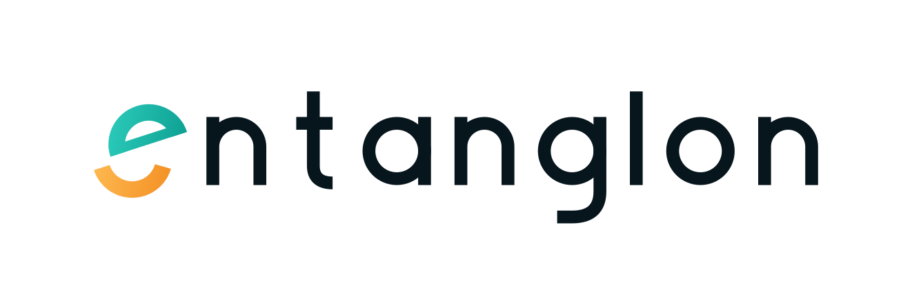

<picture>
  <source
    media="(prefers-color-scheme: dark)"
    srcset="../assets/entanglon-v2-logo-transparent-for-dark.svg">
  <source
    media="(prefers-color-scheme: light)"
    srcset="../assets/entanglon-v2-logo-transparent-for-light.svg">
  
</picture>

### Architecting coherence across distributed systems.

**Research · Engineering · Open Source**

*Applied AI tools and software built for unexplored domains.*

[Website](https://entanglon.pages.dev/) · [Documentation](https://entanglon.pages.dev/documentation.html) · [GitHub](https://github.com/entanglon)

---

## About

Entanglon is an independent research and engineering lab built around a simple idea:

> **Curiosity should be enough reason to build.**

We explore difficult problems across disciplines rather than limiting ourselves to a single category of technology. Our work currently spans software systems, biomedical engineering, privacy, media infrastructure, and applied AI.

The projects may look different on the surface. The underlying goal is the same: **turn interesting ideas into working, understandable, and openly accessible systems.**

---

## Research & Engineering

Our work currently moves across three broad areas.

### Software & Applications

Native applications, media systems, developer tools, and infrastructure designed around performance, usability, and direct interaction with the underlying platform.

### Biomedical Engineering

Applying software, computer vision, hardware, and optical techniques to problems in healthcare and biomedical research.

### Privacy & Systems

Exploring local-first architectures, self-hosted infrastructure, private storage, streaming systems, and software that keeps users in control of their data.

The boundaries are intentionally porous. A project can belong to more than one discipline.

---

## Selected Work

### Flux

A native media center for macOS built around SwiftUI and libmpv, with a focus on high-performance playback, native platform integration, and an extensible media architecture.

**Swift · SwiftUI · libmpv · Metal · macOS**

[Explore Flux →](https://github.com/entanglon/flux)

### Cascade

A privacy-oriented personal cloud and media system exploring encrypted storage, native clients, streaming, local cataloguing, and user-controlled infrastructure.

**Swift · SwiftUI · Storage Systems · Streaming · Privacy**

[Explore Cascade →](https://github.com/entanglon/cascade)

### Hydra

A streaming infrastructure project focused on resilient extraction, aggregation, and delivery across distributed sources.

**Python · FastAPI · AsyncIO · Docker**

[Explore Hydra →](https://github.com/zainulnazir/hydra)

### Engram

A local knowledge and memory system for connecting research, notes, code, and structured information into a searchable personal knowledge layer.

**Python · SQLite · Embeddings · Information Retrieval**

[Explore Engram →](https://github.com/zainulnazir/engram)

### NIR Vein Finder

A biomedical imaging system using near-infrared illumination and computer vision to investigate real-time visualization of superficial veins.

**Python · OpenCV · NIR Imaging · Raspberry Pi**

[Explore Vein Finder →](https://github.com/zainulnazir/vein-finder)

---

## How We Build

### Local & Native First

When computation can happen on the device, we prefer it there.

Native APIs, local databases, hardware acceleration, and direct system integration can produce software that is faster, more private, and more resilient than architectures that depend on unnecessary cloud infrastructure.

### Zero-Telemetry

Entanglon projects are designed with user sovereignty in mind.

We do not build our products around behavioral analytics, surveillance, or unnecessary data collection. When something can remain local, it should.

### Open by Default

Our work is open source because transparency is an engineering advantage.

Open code makes systems easier to inspect, understand, reproduce, improve, and challenge. We believe good ideas become stronger when other people can examine and build upon them.

### Cross-Domain by Design

Some of the most interesting engineering problems sit between disciplines.

Software can extend biomedical research. Hardware can change how software interacts with the physical world. AI can accelerate experimentation. Systems engineering can connect them.

Entanglon is intentionally built at those intersections.

---

## Research, Not Just Products

Entanglon is not limited to shipping conventional applications.

We use projects as vehicles for experimentation — a way to investigate an idea, test an architecture, learn from failure, and turn the resulting knowledge into something others can use.

Some experiments may become products.

Some may become infrastructure.

Some may simply teach us something worth knowing.

All of them contribute to the same body of engineering knowledge.

---

## The Long Horizon

The projects here are a beginning, not a boundary.

As Entanglon grows, its research scope is intended to move deeper into technology — from software and applied research toward areas such as **robotics, intelligent systems, operating systems, computer architecture, and other difficult problems at the intersection of computation and the physical world.**

The scope can change.

The ambition can grow.

The principles remain:

**Research deeply.  
Engineer carefully.  
Build openly.**

---

## Open Source

Entanglon projects are built in the open.

We welcome engineers, researchers, students, designers, and curious people who want to inspect the work, experiment with it, report problems, propose ideas, or contribute code.

If something here interests you, start with the repository, read the documentation, and build from there.

---

### Research. Engineer. Open Source.

**Entanglon · 2026**

[Website](https://entanglon.pages.dev/) · [Documentation](https://entanglon.pages.dev/documentation.html) · [GitHub](https://github.com/entanglon)

